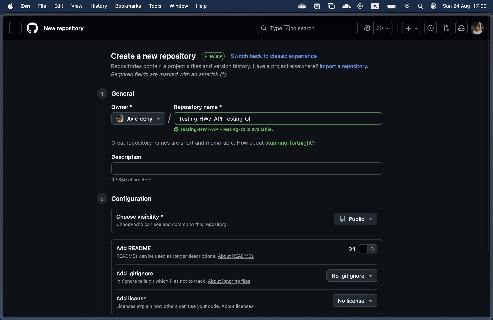
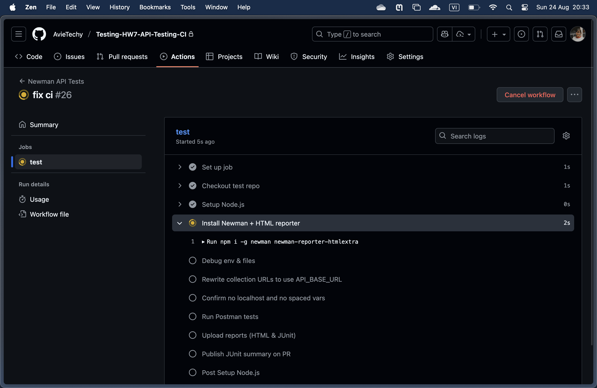
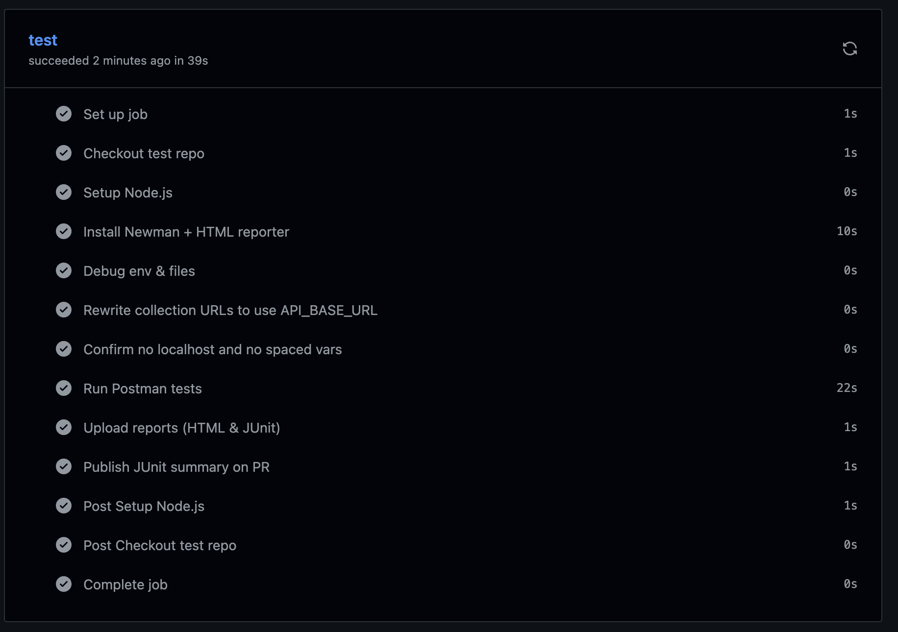

# CI Integration

This is a step-by-step guide to setting up Continuous Integration (CI) for API testing using Postman, Newman, and GitHub Actions.

1. **Export Collection and Environment from Postman**

First, you need to export the Collection containing your API requests and the Environment containing your variables from Postman.

- **Export Collection:**
  

- **Export Environment:**
  

2. Configure Collection and Environment

- **Add variables in Environment:** Ensure the following variables are added to your environment file: `API_BASE_URL`, `API_EMAIL`, `API_PASSWORD`, and `API_TOKEN`.
- **Set Authorization:** In the Collection, set the authorization method to **Bearer Token** and use the `{{API_TOKEN}}` variable.
- **Add Pre-request Script:** Add a script at the Collection level to automatically log in and fetch the token before requests are sent.

  

3. **Create and Configure GitHub Repository**

- **Create a new repository** on GitHub dedicated to storing your test files.
  

- **Add Secrets in GitHub:** To secure sensitive information, add the environment variables to the repository's **Secrets** (`Settings > Secrets and variables > Actions`):
  - `API_BASE_URL`
  - `API_EMAIL`
  - `API_PASSWORD`

4. **Add GitHub Actions Workflow**

Create a workflow file (e.g., `.github/workflows/ci.yml`) to define the CI process. This workflow will install Newman and run your test suite.

```yaml
name: API Tests CI

on:
  push:
    branches: [ main ]
  pull_request:
    branches: [ main ]

jobs:
  test:
    runs-on: ubuntu-latest
    steps:
    - name: Checkout code
      uses: actions/checkout@v3

    - name: Set up Node.js
      uses: actions/setup-node@v3
      with:
        node-version: '18'

    - name: Install Newman
      run: npm install -g newman newman-reporter-htmlextra

    - name: Run API Tests
      run: |
        newman run "22127310.postman_collection.json" \
          -e "22127310.postman_environment.json" \
          --env-var "API_BASE_URL=${{ secrets.API_BASE_URL }}" \
          --env-var "API_EMAIL=${{ secrets.API_EMAIL }}" \
          --env-var "API_PASSWORD=${{ secrets.API_PASSWORD }}" \
          -r htmlextra --reporter-htmlextra-export "report.html"

    - name: Upload Test Report
      uses: actions/upload-artifact@v3
      with:
        name: test-report
        path: report.html
```

5. **Push Code and Monitor CI**

When push changes to the repository, **GitHub Actions will run automatically**.

- **Processing workflow:**
  

- **Completed workflow:**
  

6. **Check Results and Download Report**

- **View results:** You can view the detailed results of each run in the **"Actions"** tab.
  - **Success:**
    
  - **Failure:**
    

- **Download HTML report:** The detailed HTML report will be attached as an **Artifact** for you to download.
  
  
