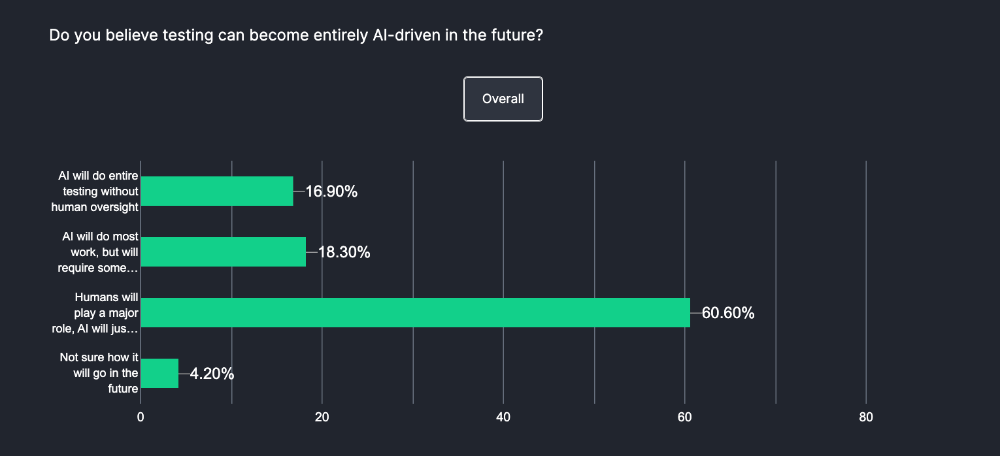

# AI trong Kiểm thử Hiệu suất

## Bối cảnh

Khi chạy các bài kiểm thử hiệu suất, bạn có thể gặp khó khăn trong việc xác thực các thông số hiệu suất khác nhau như thời gian phản hồi, thông lượng và việc sử dụng tài nguyên. Những đánh giá như vậy có thể phức tạp, tốn thời gian và thường đòi hỏi một lượng công việc thủ công đáng kể.

## AI trong Kiểm thử Hiệu suất là gì

Đơn giản nhất, chúng ta sử dụng các kỹ thuật trí tuệ nhân tạo trong quy trình kiểm thử (kiểm thử hiệu suất trong trường hợp này) để làm cho việc kiểm thử hiệu quả hơn. AI phân tích một lượng lớn dữ liệu kiểm thử một cách tự động, nhận diện các mẫu lưu lượng và đưa ra các đề xuất theo thời gian thực.

Điều này cho phép bạn nhanh chóng phát hiện các nút thắt hiệu suất và khắc phục chúng mà không cần phải làm mọi thứ một cách thủ công. Sử dụng AI, bạn cũng có thể tự động hóa việc viết test case và test script, từ đó tăng tốc thêm quá trình kiểm thử hiệu suất.

## Tại sao nên sử dụng AI trong Kiểm thử Hiệu suất?

### Ưu điểm của AI

**Quản lý Tài nguyên Thông minh**
Thay vì phải thủ công theo dõi CPU, RAM và băng thông, AI tự động phân tích mẫu sử dụng tài nguyên theo thời gian thực. Ví dụ, khi phát hiện CPU tăng 80% trong giờ cao điểm, AI có thể tự động điều chỉnh số lượng instance hoặc đề xuất scale-up. Điều này giúp tiết kiệm 30-50% chi phí infrastructure so với việc over-provisioning truyền thống.

**Phát hiện Bottleneck Nhanh Chóng**
AI phân tích đồng thời hàng nghìn metrics (response time, database queries, network latency) để xác định nguyên nhân gốc rễ. Trong khi tester thủ công có thể mất 2-3 giờ để trace một vấn đề hiệu suất, AI có thể pinpoint chính xác stored procedure chậm hoặc API endpoint có vấn đề trong vòng vài phút.

**Dự đoán Hiệu suất với Machine Learning**
AI sử dụng historical data để training model dự đoán. Ví dụ, dựa trên pattern traffic của 6 tháng qua, AI có thể dự đoán hệ thống sẽ đạt ngưỡng 1000 concurrent users vào Black Friday và đề xuất capacity planning cụ thể. Độ chính xác có thể đạt 85-95%.

**Học hỏi từ Patterns Lịch sử**
AI phân tích correlation giữa các events: "Mỗi khi traffic tăng 200% vào 8-9AM, database connection pool đạt maximum và response time tăng 3x". Từ đó tự động tạo regression test cases cho những scenario tương tự.

**Early Warning System**
AI thiết lập dynamic thresholds thay vì static alerts. Thay vì cảnh báo khi response time > 2s, AI học pattern bình thường và cảnh báo khi có anomaly (ví dụ response time tăng 40% so với baseline trong cùng thời điểm tuần trước).

**Real-time Monitoring và Auto-remediation**
AI không chỉ detect mà còn có thể auto-scale, restart services, hoặc redirect traffic khi phát hiện degradation. Ví dụ, khi memory leak được detect, AI có thể trigger restart microservice mà không cần human intervention.

**Tự động hóa Test Generation**
AI phân tích production traffic để tự động generate realistic load test scenarios. Thay vì manually tạo 100 test cases, AI có thể generate 1000+ scenarios dựa trên real user behavior patterns, bao gồm cả edge cases.

### Nhược điểm và Thách thức khi sử dụng AI

**Bias và Sai lệch từ Prompt Engineering**
Nguyên tắc "Garbage In, Garbage Out - GIGO", AI có thể tạo ra kết quả sai lệch khi prompt không được thiết kế tỉ mỉ hoặc thiếu context đầy đủ. Ví dụ, khi prompt chỉ yêu cầu "tối ưu hiệu suất" mà không nêu rõ ràng buộc về budget, AI có thể đề xuất giải pháp quá đắt đỏ hoặc không phù hợp với thực tế. Việc thiếu domain knowledge trong prompt design có thể dẫn đến AI hiểu sai bối cảnh và tạo ra test scenarios không realistic.

**Chi phí Ban đầu Cao**
Triển khai AI cho kiểm thử hiệu suất đòi hỏi đầu tư lớn ban đầu bao gồm máy chủ mạnh (có GPU), giấy phép phần mềm đắt đỏ, và thuê chuyên gia AI. Chi phí khởi đầu có thể từ 1-10 tỷ đồng tùy quy mô dự án, chưa kể chi phí vận hành hàng tháng.

**Rủi ro Phụ thuộc Nhà cung cấp**
Mỗi nhà cung cấp AI có thuật toán và định dạng dữ liệu riêng. Chuyển đổi từ Dynatrace sang BlazeMeter có thể yêu cầu triển khai lại hoàn toàn. Trường hợp xấu nhất, nếu nhà cung cấp ngừng dịch vụ, toàn bộ hệ thống AI có thể trở nên lỗi thời.

**Vấn đề Blank box - Khó giải thích**
Khi AI đề xuất "tăng bộ nhớ 40%", bạn không có cái nhìn sâu về lý do cơ bản. Điều này tạo ra khó khăn trong việc xác thực các đề xuất của AI và có thể dẫn đến phụ thuộc quá mức hoặc hoàn toàn không tin tưởng các khuyến nghị của AI.

**Phụ thuộc Chất lượng Dữ liệu**
Độ chính xác của AI hoàn toàn phụ thuộc vào chất lượng dữ liệu training. Nếu historical data không đầy đủ hoặc thiên lệch (nói dễ hiểu là data không chất lượng), AI sẽ tạo ra prediction không chính xác.

**Learning Curve và Thích ứng Team**
Các team cần đầu tư thời gian đáng kể để thành thạo các tool AI, interpret kết quả chính xác, và handle các lỗi AI hiệu quả. Điều này có thể tạm thời giảm productivity trong giai đoạn deployment ban đầu.

**Rủi ro Phụ thuộc Quá mức**
Các nhóm có thể dần mất kỹ năng kiểm thử thủ công và khả năng tư duy phản biện. Nếu hệ thống AI gặp sự cố hoặc không khả dụng, các nhóm có thể gặp khó khăn với các tác vụ phân tích hiệu suất cơ bản.

## Các Công cụ Phổ biến

### Top Công cụ AI cho Kiểm thử Hiệu suất

| Thứ hạng | Công cụ | Điểm mạnh | Nhược điểm | Giá cả | Phù hợp cho |
|----------|---------|-----------|------------|--------|-------------|
| 1 | **Dynatrace** | AI phân tích toàn diện, giám sát thời gian thực | Giá thành cao, cấu hình phức tạp | Enterprise | Hệ thống lớn, phức tạp |
| 2 | **BlazeMeter** | Kiểm thử tải mạnh mẽ, tích hợp CI/CD | Yêu cầu kiến thức kỹ thuật cao | Từ $99/tháng | DevOps, kiểm thử liên tục |
| 3 | **StormForge** | Tối ưu ML cho Kubernetes, dự đoán mở rộng | Chỉ phù hợp với Kubernetes | Tùy chỉnh | Ứng dụng cloud-native |
| 4 | **Functionize** | AI tạo test tự động, bảo trì thông minh | Hạn chế tùy chỉnh, phụ thuộc AI | Tùy chỉnh | Ứng dụng web doanh nghiệp |
| 5 | **Testim** | Test tự phục hồi, phân tích nguyên nhân | Thiếu tính năng kiểm thử hiệu suất sâu | Tùy chỉnh | Kiểm thử end-to-end |
| 6 | **LambdaTest** | Đa trình duyệt, thiết bị thực | Hiệu suất không ổn định khi tải cao | Từ $15/tháng | Kiểm thử tương thích |
| 7 | **Telerik Test Studio** | Hỗ trợ .NET, phát hiện element thông minh | Chỉ tối ưu cho Microsoft stack | $2,499/năm | Ứng dụng .NET |

TUy nhiên chỉ có BlazeMeter, LambdaTest và Testim là có bản freemium, phù hợp cho hợp vi đồ án môn học.

## Prompt sử dụng

\pagebreak
