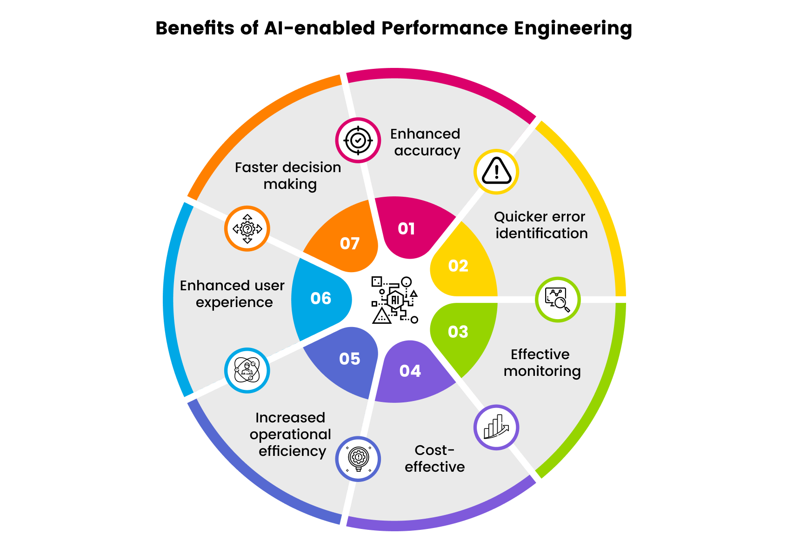
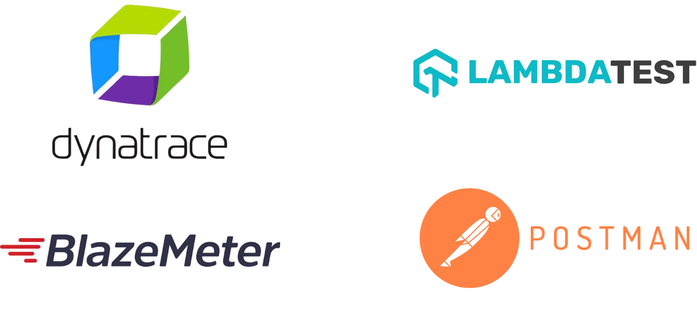

## AI in Performance Testing

### Background

When conducting performance tests, one of the most challenging tasks is validating multiple performance indicators such as response time, throughput, and resource utilization. This process is often complex, time-consuming, and heavily dependent on manual effort.

The adoption of Artificial Intelligence (AI) in performance testing aims to overcome these limitations. By automatically analyzing large datasets of performance metrics, AI can identify traffic patterns, detect anomalies, and even provide real-time recommendations. This reduces manual work, shortens analysis time, and improves the accuracy of bottleneck detection.

### What is AI in Performance Testing?

At its core, AI in performance testing refers to applying intelligent algorithms and machine learning techniques to make the testing process more efficient and insightful. Instead of relying solely on manual test execution and analysis, AI-driven systems:

- Continuously analyze large volumes of logs, traces, and metrics.
- Automatically detect anomalies and root causes.
- Generate or optimize test scenarios based on real-world traffic data.

This integration transforms performance testing from a manual and reactive process into a proactive and intelligent practice.

### Why Use AI in Performance Testing?

- **Smart Resource Management**: Continuously optimizes infrastructure usage to avoid over/under-provisioning.
    - **Example**: When CPU stays above 80% for 5 minutes, AI recommends scaling one more application pod, cutting monthly costs by 35%.

- **Rapid Bottleneck Detection**: Correlates metrics, logs, and traces to isolate slow components fast.
    - **Example**: Flags a specific SQL query adding 450 ms latency to a checkout API within 2 minutes of test start.

- **Predictive Performance (ML Forecasting)**: Uses historical load to predict future demand and capacity needs.
    - **Example**: Forecasts 1,200 concurrent users for a campaign window and advises doubling read replicas 6 hours in advance.

- **Learning from Historical Patterns**: Mines past incidents to prevent repeat failures and generate regression scenarios.
    - **Example**: Detects a recurring memory leak pattern and auto-creates a targeted soak test for the next cycle.

- **Dynamic Alerts & Early Warnings**: Adjusts thresholds based on baselines to reduce noise and catch true anomalies.
    - **Example**: Triggers an alert when response time rises 40% over last week’s median instead of a static 2 s rule.

- **Real-Time Monitoring & Auto-Remediation**: Detects degradation and executes predefined corrective actions.
    - **Example**: Automatically restarts a degraded container and shifts 15% traffic to a healthy region.

- **Automated Test Generation**: Derives realistic workloads from production behavior to expand coverage.
    - **Example**: Generates 300 user journeys (e.g., browse → compare → add to cart) from real clickstream data for load rehearsal.

### Popular Tools with AI Features

| Tool                          | Description                                                                                                                             | Key Weakness                                                                                       |
| ----------------------------- | --------------------------------------------------------------------------------------------------------------------------------------- | -------------------------------------------------------------------------------------------------- |
| **Dynatrace**                 | Provides automatic anomaly detection and root cause analysis using Davis AI on logs, traces, and metrics.                               | High cost; complex installation and configuration.                                                 |
| **BlazeMeter**                | Supports large-scale load and stress testing; includes data analysis and recommendations for script/test data optimization.             | Requires technical expertise for effective usage.                                                  |
| **LambdaTest (HyperExecute)** | Enables cloud-based load tests (e.g., JMeter integration), collects KPIs like response time and error insights across multiple regions. | Lacks advanced AI-powered root cause analysis.                                                     |
| **Postman**                   | Provides API performance testing with virtual users, monitoring response time, error rate, and throughput.                              | Limited scalability for very large or complex performance scenarios compared to specialized tools. |

### Tool Comparison and Suitability

| Rank | Tool           | Strengths                                                | Weaknesses                              | Pricing                  | Best Fit                                      |
| ---- | -------------- | -------------------------------------------------------- | --------------------------------------- | ------------------------ | --------------------------------------------- |
| 1    | **Dynatrace**  | Comprehensive AI-based analysis, real-time monitoring    | Expensive, complex setup                | Enterprise-level pricing | Large, complex systems                        |
| 2    | **BlazeMeter** | Powerful load testing, CI/CD integration                 | Requires technical expertise            | From \$99/month          | DevOps and continuous testing                 |
| 3    | **LambdaTest** | Cloud-based execution, supports multiple regions         | Limited AI analysis                     | From \$15/month          | Cross-browser and distributed load testing    |
| 4    | **Postman**    | Easy-to-use API performance testing, free tier available | Not suitable for very large-scale tests | Freemium                 | Small to medium projects, API-focused testing |

### Current AI Trends in Performance Testing

- **Predictive Performance Analytics**: Forecasts future load, saturation points, and capacity needs instead of only reporting past results.
- **Deep DevOps / CI/CD Embedding**: AI engines run inside pipelines to gate merges with latency, error, and regression signals.
- **Self-Healing Test Assets**: Automatically updates locators, payloads, or workflow steps when UI/API contracts drift.
- **Automated Capacity & Cost Optimization**: Trains on historical usage to recommend right-sizing, scaling windows, and instance families.
- **Autonomous Monitoring & Remediation**: Progressing from anomaly detection to triggering rollbacks, scaling actions, or traffic re-routing.
- **Context-Aware Alerting**: Dynamic baselines reduce noise by comparing against seasonality, release windows, and user cohorts.
- **Root Cause Correlation Graphs**: Causal mapping links spikes in latency to specific services, queries, or infrastructure layers.
- **Synthetic + Real User Blending**: AI fuses RUM, APM, and synthetic journeys to generate more realistic load models.
- **Intelligent Test Scenario Generation**: Derives high-impact user flows from production clickstream clustering.
- **Explainability & Trust Tooling**: Emerging features expose why an anomaly was flagged (metric deltas, dependency path, confidence score).

### Challenges and Limitations

- **Bias & Prompt Design Errors**: Inaccurate or incomplete prompts can yield unrealistic test cases or costly recommendations.
- **High Initial Investment**: Significant upfront spend on infrastructure, licensing, integration, and specialized expertise.
- **Vendor Lock-In**: Migrating between platforms (e.g., Dynatrace to BlazeMeter) is complex, risky, and expensive.
- **Black-Box Nature**: Limited explainability of AI outputs lowers tester trust and slows adoption.
- **Data Dependency**: Insufficient or poor-quality historical data degrades model accuracy and prediction reliability.
- **Learning Curve**: Teams require training time to interpret insights and tune models effectively.
- **Over-Reliance on AI**: Excess dependence can reduce manual skill development and critical performance analysis.

\pagebreak
