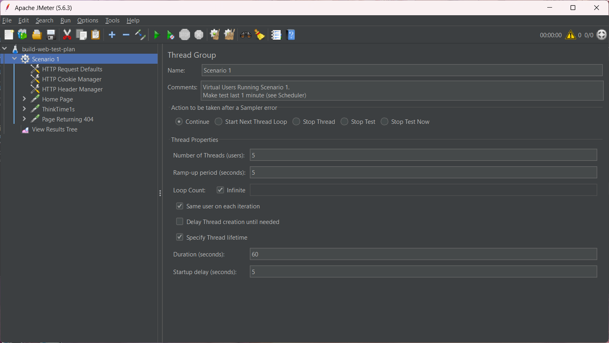

# Apache JMeter

This section introduces Apache JMeter—identified in the prior comparison table as a leading open-source tool for performance testing. It will move from core concepts to practical details and conclude with an end-to-end performance test scenario built in JMeter.

## JMeter's Overall Architecture

Apache JMeter is an open-source tool designed for performance and load testing of web applications and various other services. JMeter has a modular, plugin-based architecture that helps organize and simulate test flows.

The main components in JMeter's architecture include:

- **Test Plan**: The root structure of every test, defining the entire test configuration and behavior.
- **Thread Group**: Represents virtual users, simulating a large number of users accessing the system.
- **Samplers**: Send specific requests to the system under test.
- **Logic Controllers**: Control the execution flow within a Thread Group.
- **Listeners**: Record and display test results.
- **Configuration Elements**: Provide default settings for Samplers.
- **Timers**: Add delays between requests.
- **Assertions**: Verify that the response matches expectations.
- **Pre/Post-Processors**: Process data before or after a request is sent.

These components can be nested in a hierarchical structure within a Test Plan to create complex test scenarios.

## Thread Group

A Thread Group is the primary element for configuring how users are simulated. Each Thread Group can be configured with the following settings:

- **Number of Threads (users)**: The number of virtual users to simulate.
- **Ramp-Up Period (seconds)**: The time it takes to start all the virtual users.
- **Loop Count**: The number of times each user will repeat the test script.

Thread Groups also allow you to configure what happens on an error (e.g., stop the test, skip the sampler) and can contain many child elements like Samplers, Timers, and Assertions.

For example, if you configure 50 threads with a 10-second ramp-up and a loop count of 2, JMeter will start 5 threads every second, and each user will send their requests twice.

## Sampler

A Sampler is responsible for sending different types of requests to the system being tested. Each Sampler corresponds to a specific protocol or action.

Some common types of Samplers include:

- **HTTP Request**: Sends HTTP/HTTPS requests to a web server.
- **JDBC Request**: Sends SQL queries to a database via JDBC.
- **FTP Request**: Sends requests to upload or download files from an FTP server.
- **SOAP/XML-RPC Request**: Sends requests to SOAP-based web services.
- **Java Request**: Allows you to directly call custom Java classes.
- **JMS Request**: Used to send/receive messages through a JMS system.

Samplers are crucial as they determine what system is being tested and how.

## Listener

A Listener is a component that helps collect, record, and display test results. Listeners can write to a log, display real-time reports, or save results to a file for later analysis.

Some typical Listeners are:

- **View Results Tree**: Shows the details of every single request and response.
- **Summary Report**: Provides aggregate statistics like the number of requests, average response time, error rate, etc.
- **Aggregate Report**: Displays advanced aggregate information like standard deviation, response time percentiles, etc.
- **Graph Results**: Plots test data on a graph.
- **View Results in Table**: Displays a list of requests in a table format.

Choosing the right Listener makes analyzing system performance more intuitive and accurate.

## Timers, Assertions, Pre-Processors, and Post-Processors

1.  **Timers**

Timers are used to add delays between requests to simulate realistic user behavior. Some commonly used Timers are:

- **Constant Timer**: Adds a fixed delay.
- **Uniform Random Timer**: Adds a random delay with a uniform distribution.
- **Gaussian Random Timer**: Adds a random delay with a normal (Gaussian) distribution.
- **Synchronizing Timer**: Pauses threads to send requests all at once.

2.  **Assertions**

Assertions are used to verify that the response from the server is correct and valid. Some common Assertions include:

- **Response Assertion**: Checks the response content or status code.
- **Duration Assertion**: Checks that the response time does not exceed a specified value.
- **Size Assertion**: Checks the size of the response.
- **JSON/XML Assertion**: Checks the structure and data of JSON/XML in the response.

Assertions help evaluate the correctness of the system, not just its performance.

3.  **Pre-Processors**

A Pre-Processor is executed before a Sampler runs. It is often used to:

- Prepare input data.
- Generate dynamic tokens, headers, or values.
- Call functions from BeanShell or JSR223 for custom logic.

An example is "User Defined Variables," which sets up values to be used in subsequent requests.

4.  **Post-Processors**

A Post-Processor is executed after a Sampler sends a request. It is used to:

- Extract data from the response to use in a later step.
- Save data, write to a log, or process the response string.
- The most popular are the **Regular Expression Extractor**, **JSON Extractor**, and **XPath Extractor**.

\pagebreak
