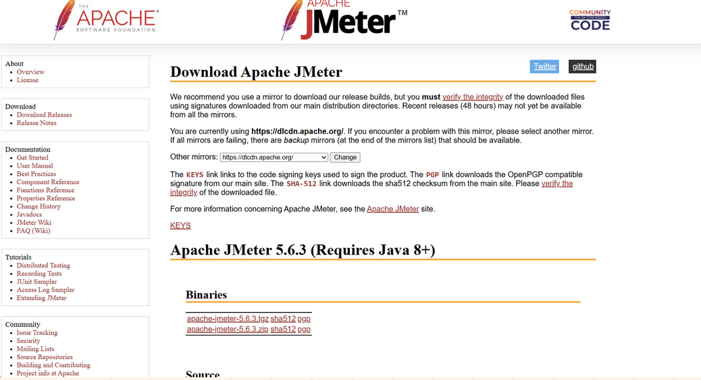
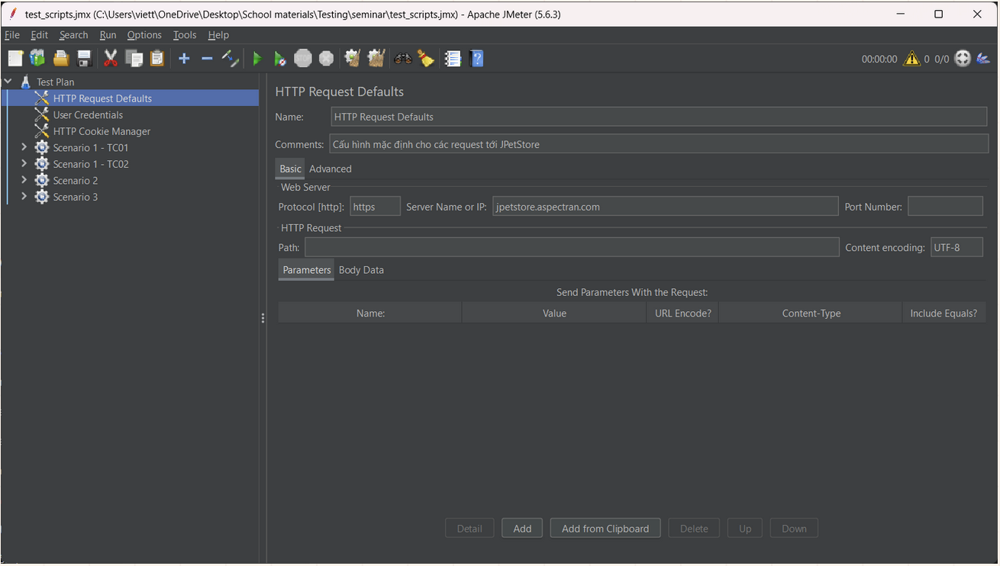

## Installing Apache JMeter: Step-by-Step Guide

1. **Step 1: Install Java**
    JMeter requires Java (JDK) 8 or later (Java 17 is a well-tested choice).
    Supported operating systems: Windows, Linux, macOS.
    No extra runtime needed beyond Java.
    Download and install one of:
    - Oracle JDK: https://www.oracle.com/java/technologies/javase-downloads.html
    - OpenJDK (Adoptium): https://adoptium.net
    Verify installation:
    ```bash
    java -version
    ```
2. **Step 2: Download JMeter**
    Get the latest binary (.zip for Windows, .tgz for Linux/macOS):
    https://jmeter.apache.org/download_jmeter.cgi

    

3. **Step 3: Extract**
    - Download the archive.
    - Extract to any folder (no installer required).
    - On Windows you will use the .bat launcher; on macOS/Linux the shell script in bin/.

4. **Step 4: Launch**
    In the extracted bin directory run:
    - Windows:
      ```bat
      jmeter.bat
      ```
    - macOS / Linux:
      ```bash
      ./jmeter
      ```
    The JMeter GUI will open.

    

\pagebreak
