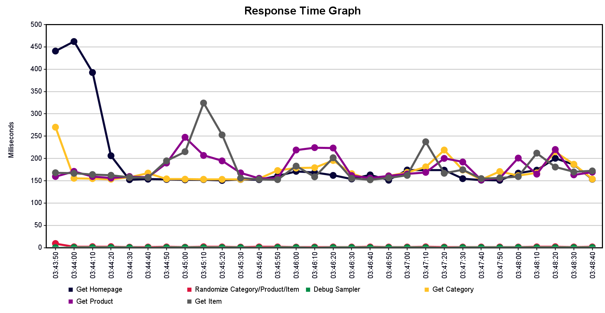
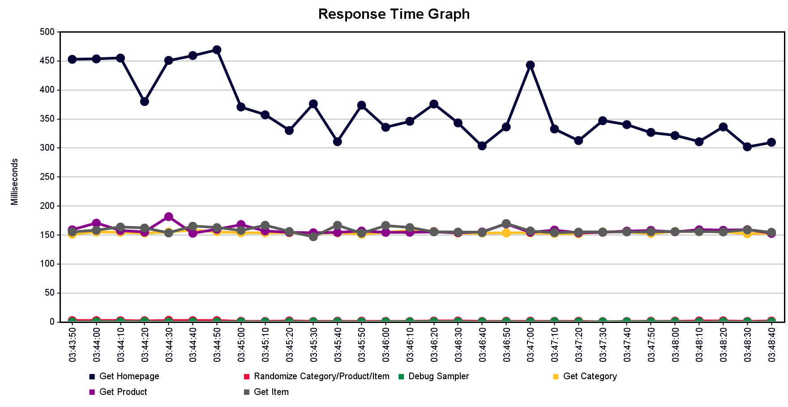
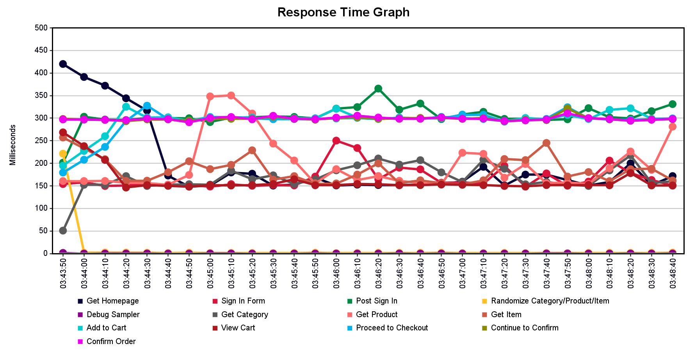

# Experimental Demonstration

## Hands-On Performance Testing Scenario with JMeter

### Overview

The purpose of this Performance Testing Plan is to outline the strategy for planning and managing performance testing activities for the [JPetStore](https://github.com/aspectran/aspectran-jpetstore) system, an open-source web application simulating an e-commerce process. This document details the **Performance Testing Approach** using [Apache JMeter](https://jmeter.apache.org/index.html) and serves as a comprehensive guide for the team's testing process.

### Objectives

- Identify key functionalities and business flows for performance testing.
- Define the testing approach, including JMeter usage, input data, and evaluation criteria.
- Specify required resources: tools, test environments, data, and personnel.
- List deliverables: test scripts (`.jmx`), execution results (`.csv`), statistical charts, reports, and demo videos.

### Scope

The project involves both research and practical performance testing for the JPetStore system, including:

- Studying performance testing theory: concepts, processes, and its role in software testing.
- Researching types of performance testing: Load, Stress, Spike, and Endurance Testing.
- Comparing performance testing tools: Apache JMeter, NeoLoad, WebLOAD, LoadUI, and LoadRunner.
- Deep exploration of Apache JMeter: architecture, components, installation, and configuration.
- Investigating AI applications in performance testing, such as automated analysis, error prediction, and process optimization.
- Conducting tests on the **JPetStore** demo system.
- Designing and executing test scenarios for common user flows:
  - **Scenario 1**: Browsing products without logging in.
  - **Scenario 2**: Logging in and completing a full purchase process.
  - **Scenario 3**: Logging in and accessing personal account information.

### Testing Activities

The team will conduct system-level performance testing to evaluate the response time and stability of JPetStore under concurrent user access. Key activities include:

- Designing and executing **test scenarios** to simulate realistic user behaviors for the three specified flows:
  - **Scenario 1**: Browsing products without logging in.
  - **Scenario 2**: Logging in and completing a full purchase.
  - **Scenario 3**: Logging in and accessing account information.
- Using **Apache JMeter** to create and execute performance test scenarios.
- Collecting and analyzing performance metrics:
  - **Response Time**
  - **Throughput**
  - **Error Rate**
- Applying techniques such as:
  - Dynamic input data (CSV).
  - Timers to simulate think time.
  - Assertions to validate response results.

### Deliverables

- Test scripts (`.jmx` files).
- Execution results (`.csv` files).
- Statistical charts and reports.
- Demo videos showcasing the testing process.

## Scenario 1 – Browse-Only Load

### Purpose
Evaluate system performance for users browsing products without logging in, simulating real-world catalog and product detail access. Measure **response time**, **error rate**, and **throughput** under typical load.

### User Flow
| Step | Action | HTTP Method | Think Time |
|--|--------------|:-------:|------|
| 1    | Access homepage (`/`) | `GET` | 2–5s |
| 2    | Access category (e.g., `/categories/FISH`) | `GET` | 3–6s |
| 3    | Select product (e.g., `/products/FI-SW-01`) | `GET` | 5–10s |
| 4    | View item details (e.g., `/products/FI-SW-01/items/EST-1`) | `GET` | — |

### Test Case 1 – Load Testing

#### General Information

| Attribute | Details |
|--------|-----------|
| **Scenario Name** | Browse-Only Load |
| **Test Case ID** | TC01_BrowseOnly_Load |
| **Objective** | Test system performance for browsing without login |
| **Test Type** | Load Testing |
| **Components** | Homepage, category, product, item details |
| **Input Data** | CSV file: `categoryId`, `productId`, `itemId` |
| **Sample Data** | FISH, FI-SW-01, EST-1 |
| **Pre-condition** | JPetStore running at [https://jpetstore.aspectran.com](https://jpetstore.aspectran.com/) |

#### JMeter Configuration

| Parameter | Value |
|-----------|-------|
| Threads | 40 |
| Ramp-up Time | 30s |
| Loop | Infinite |
| Duration | 5 min |

#### JMeter Setup

- **Data Source**: CSV (`product_summary.csv`) with `categoryId`, `productId`, `itemId`.
- **Logic Controller**:
  - Random Controller: Selects random CSV row.
  - If Controller: Ensures valid `categoryId`, `productId`, `itemId`.
- **Samplers**: 4 HTTP Requests using dynamic endpoints (`${categoryId}`, `${productId}`, `${itemId}`).
- **Timers**: Uniform Random Timer (2000–5000ms, 3000–6000ms, 5000–10000ms).
- **Assertions**: Response Code = 200; Response Body contains "Product ID" or "Add to Cart"/"Item ID".

#### Measurement Goals

- 95% response time < 2000ms.
- Error Rate = 0%.
- Stable throughput over 5 minutes.

### Test Case 2 – Spike Testing

#### General Information

| Attribute | Details |
|-----------|------------|
| **Scenario Name** | Spike Load with Recovery |
| **Test Case ID** | TC02_Spike_Load |
| **Objective** | Assess performance and recovery under sudden load spikes |
| **Test Type** | Spike Testing |
| **Components** | Homepage, category, product, item details |
| **Input Data** | CSV file: `categoryId`, `productId`, `itemId` |
| **Sample Data** | FISH, FI-FW-01, EST-1 |
| **Pre-condition** | JPetStore running at [https://jpetstore.aspectran.com](https://jpetstore.aspectran.com/) |

#### JMeter Configuration (Ultimate Thread Group)

| Stage | Threads | Initial Delay (s) | Startup Time (s) | Hold Load (s) | Shutdown Time (s) | Description |
|-------|---------|------------------|------------------|---------------|-------------------|-------------|
| 1     | 10      | 0                | 5                | 60            | 10                | Warm-up |
| 2     | 25      | 65               | 10               | 60            | 0                 | Gradual increase |
| 3     | 70      | 135              | 0                | 20            | 5                 | Spike 1 |
| 4     | 25      | 155              | 5                | 60            | 0                 | Recovery |
| 5     | 100     | 220              | 0                | 20            | 5                 | Spike 2 |
| 6     | 25      | 240              | 5                | 60            | 5                 | Stabilize |
- **Total Duration**: $\approx$ 5 min.

#### JMeter Setup

- **Data Source**: CSV (`product_summary.csv`) with `categoryId`, `productId`, `itemId`.
- **Logic Controller**: Random Controller; If Controller for valid data; optional JSR223 Sampler (Groovy).
- **Samplers**: 4 HTTP Requests with dynamic endpoints.
- **Timers**: Uniform Random Timer (2000–5000ms, 3000–6000ms, 5000–10000ms).
- **Assertions**: Response Code = 200; Response Body contains "Product ID" or "Add to Cart"/"Item ID".

#### Measurement Goals

- 95% response time < 2000ms (even during spikes).
- Error Rate ≤ 3% during spikes.
- Throughput spikes and stabilizes within 1–2 min.

## Scenario 2 – Full Purchase Flow Under Load

### Purpose

Simulate a complete purchase process (login, category/product selection, cart addition, checkout). Assess system performance under complex, session-based operations. Measure **response time**, **error rate**, and **throughput** under sustained load.

### User Flow

| Step | Action | HTTP Method | Think Time |
|--|--------------|:-------:|------|
| 1    | Access homepage (`/`) | `GET` | 2–4s |
| 2    | Access login page (`/account/signonForm`) | `GET` | 3–5s |
| 3    | Login (`/account/signon`) | `POST` | 3–5s |
| 4    | Access category (`/categories/{categoryId}`) | `GET` | 3–6s |
| 5    | Access product (`/products/{productId}`) | `GET` | 2–4s |
| 6    | Access item (`/products/{productId}/items/{itemId}`) | `GET` | 5–8s |
| 7    | Add to cart (`/cart/addItemToCart?itemId=...`) | `GET` | 0 |
| 8    | View cart (`/cart/viewCart`) | `GET` | 2–4s |
| 9    | Access order form (`/order/newOrderForm`) | `GET` | 1–3s |
| 10   | Submit order (`/order/newOrder`) | `POST` | 1–2s |
| 11   | Confirm order (`/order/submitOrder`) | `POST` | — |

### Test Case 1 – Load Testing

#### General Information

| Attribute | Details |
|-----------|---------|
| **Scenario Name** | Full Purchase Flow Under Load |
| **Test Case ID** | TC01_Purchase_Load |
| **Objective** | Evaluate system under full purchase flow |
| **Test Type** | Load Testing |
| **Components** | Homepage, login, category, product, cart, checkout |
| **Input Data** | CSV files: `username`, `password`; `categoryId`, `productId`, `itemId` |
| **Sample Data** | j2ee, j2ee, FISH, FI-SW-01, EST-1 |
| **Pre-condition** | JPetStore running at [https://jpetstore.aspectran.com](https://jpetstore.aspectran.com/) |

#### JMeter Configuration

| Parameter | Value |
|-----------|-------|
| Threads | 40 |
| Ramp-up Time | 45s |
| Loop | Infinite |
| Duration | 5 min |

#### JMeter Setup

- **Data Sources**:
  - CSV (`users_60.csv`): `username`, `password`.
  - CSV (`product_summary.csv`): `categoryId`, `productId`, `itemId`.
- **Logic Controller**: Thread Group for all steps; Random Controller for product access; If Controller for valid data; optional JSR223 Sampler.
- **Samplers**: HTTP Requests for each step using dynamic variables (`${categoryId}`, `${productId}`, `${itemId}`, `${username}`, `${password}`).
- **Timers**: Uniform Random Timer for user think time.
- **Assertions**: Response Code = 200 (302 for `submitOrder` if redirects disabled); confirm order success in final response.

#### Measurement Goals

- 95% response time < 3000ms for checkout steps.
- Error Rate ≈ 0%.
- Successful order confirmation.
- No timeouts on login, cart, or checkout.

## Scenario 3 – Concurrent Login & Account Access

### Purpose

Test system stability under continuous login and account access (endurance test). Evaluate **response time**, **error rate**, **memory**, and **throughput** with frequent session creation/deletion. Analyze error behavior and recovery during load changes.

### User Flow

| Step | Action | HTTP Method | Think Time |
|--|--------------|:-------:|------|
| 1    | Access homepage (`/`) | `GET` | 2–3s |
| 2    | Access login page (`/account/signonForm`) | `GET` | 4–6s |
| 3    | Login (`/account/signon`) | `POST` | 3–5s |
| 4    | Access “My Account” (`/account/editAccountForm`) | `GET` | 4–7s |
| 5    | Logout (`/account/signoff`) | `GET` | — |

### Test Case 1 – Endurance Testing

#### General Information

| Attribute | Details |
|-----------|---------|
| **Scenario Name** | Concurrent Login & Account Access |
| **Test Case ID** | TC01_Concurrent_Login |
| **Objective** | Test system under continuous session creation/deletion |
| **Test Type** | Endurance Testing |
| **Components** | Homepage, login, account, logout |
| **Input Data** | CSV file: `username`, `password` |
| **Sample Data** | j2ee, j2ee |

#### JMeter Configuration (Ultimate Thread Group)

| Threads | Initial Delay | Startup Time | Hold Load | Shutdown Time | Notes |
|---------|--------------|--------------|-----------|---------------|-------|
| 5       | 0s           | 25s          | 300s      | 50s           | Warm-up |
| 10      | 325s         | 50s          | 300s      | 75s           | Medium load |
| 25      | 675s         | 75s          | 300s      | 100s          | High load |
| 40      | 1050s        | 100s         | 10800s (3h) | 75s         | Main endurance |
| 25      | 11950s       | 75s          | 300s      | 50s           | Reduce load |
| 10      | 12325s       | 50s          | 300s      | 25s           | Recovery |

#### JMeter Setup

- **Data Source**: CSV (`users_60.csv`): `username`, `password`.
- **Logic Controller**: Thread Group per load stage; executes login → account → logout.
- **Samplers**: HTTP Requests for each step using `${username}`, `${password}`.
- **Timers**: Uniform Random Timer for user think time.
- **Assertions**: Response Code = 200; verify `editAccountForm` content post-login.

#### Technical Notes

- Demo runs up to login (`POST /signon`) for first 1.5h.
- Monitor error rate closely from minutes 15–22 (load increases from 5 to 40 users).
- Error rate may spike to $\approx$ 8% but stabilizes at $\approx$ 6%.
- Ensure stable network for long endurance runs.

#### Measurement Goals

- 95% response time post-login < 2000ms.
- Average error rate < 5% during endurance.
- Complete login → account access → logout cycle without errors.
- Track error rate changes during load increase/decrease.

\pagebreak

## Execution Results and AI-Supported Analysis

### Scenario 1 – Browse-Only Load

#### Test Case TC01 – Load Testing

| Metric             | Value            |
| ------------------ | ---------------- |
| Total Requests     | 2,902            |
| Avg. Response Time | **118 ms**       |
| 95% Line           | **244 ms**       |
| Max Response Time  | **509 ms**       |
| Error Rate         | **0.00%**        |
| Throughput         | **9.75 req/sec** |

$\Longrightarrow$ System handled browsing load smoothly with no errors and low latency. 95% of requests completed in under 244 ms.

#### Test Case TC02 – Spike Testing

| Metric             | Value            |
| ------------------ | ---------------- |
| Total Requests     | 2,343            |
| Avg. Response Time | **134 ms**       |
| 95% Line           | **455 ms**       |
| Max Response Time  | **509 ms**       |
| Error Rate         | **0.00%**        |
| Throughput         | **7.67 req/sec** |

$\Longrightarrow$ During sudden traffic spikes, performance stayed stable. Slight increase in 95% percentile observed, but still under 500 ms — well within acceptable thresholds.

### Scenario 2 – Full Purchase Flow

| Metric             | Value            |
| ------------------ | ---------------- |
| Total Requests     | 3,651            |
| Avg. Response Time | **195 ms**       |
| 95% Line           | **316 ms**       |
| Max Response Time  | **598 ms**       |
| Error Rate         | **0.00%**        |
| Throughput         | **12.3 req/sec** |

$\Longrightarrow$ The system managed the full login-to-checkout journey under consistent load with impressive stability. Checkout steps (Add to Cart $\rightarrow$ Submit Order) had slightly higher latency but remained within acceptable bounds.

### Scenario 3 – Concurrent Login & Account Access (Endurance Test)

| Metric             | Value             |
| ------------------ | ----------------- |
| Total Requests     | **130,575**       |
| Avg. Response Time | **241 ms**        |
| 95% Line           | **445 ms**        |
| Max Response Time  | **31,957 ms** (!) |
| Error Rate         | **0.02%**         |
| Throughput         | **10.29 req/sec** |

$\Longrightarrow$ This was the longest-running and most intense test. While average performance was stable, a few extreme outliers (31s max) were recorded. Error rate remained low ($\approx$ 0.02%) but spiked during ramp-up periods.

## Insights & Analysis

1. Anomaly Detection
    - Observed a small set of extreme latency outliers in Scenario 3 (20–31 s vs 95% < 450 ms).
    - Pattern: isolated, not clustered, suggest long-tail pauses.
    - Likely causes: JVM GC pauses, transient thread pool saturation, external dependency stalls, or network hiccups.
    - Actions:
        - Correlate timestamps with server GC / CPU / heap graphs.
        - Enable server-side slow request logging (include thread dump trigger >5 s).
        - Add PerfMon / JFR listeners for next endurance run.
        - Consider tuning: heap sizing, GC algorithm, connection pool max, async IO.

2. Percentile Drift
- All scenarios: 95th percentile < 500 ms → strong interactive responsiveness.
- Scenario 2 checkout steps show relatively higher (still < 600 ms) due to multi-step stateful operations (cart + order submission).
- No widening gap between avg and 95th → latency distribution tight except rare Scenario 3 spikes.
- Actions:
    - Track p99 in future runs to confirm tail stability.
    - Segment metrics by step (login, add-to-cart, submit order) to isolate heavier endpoints.

3. Load Resilience
- Scenarios 1 & 2: Throughput stable, zero errors → healthy under typical and spike patterns.
- Scenario 3: Long endurance with gradual ramps surfaced tail spikes without significant error amplification (0.02% overall).
- Recovery after load transitions was fast; no sustained degradation.
- Actions:
    - Introduce controlled chaos (network latency injection) to validate resilience.
    - Add soak-phase leak detection: monitor open sessions, threads, heap growth slope.

4. Resource Efficiency
- Throughput range: 7–12 req/s across mixes; proportional to concurrent user behavior patterns.
- Bandwidth usage stable; no evidence of payload bloat.
- Low error rate implies minimal wasted retries or amplified load.
- Actions:
    - Capture server-side CPU per request to confirm headroom for scaling.
    - Add response size assertions to detect accidental payload inflation in future builds.

5. Prioritized Recommendations

- Instrument & correlate (GC, thread pools, DB timings) to explain Scenario 3 outliers.
- Add p99 / p99.9 tracking and step-level dashboards.
- Implement slow request tracing (>2 s) with contextual metadata.
- Run repeat endurance test after tuning to validate reduction of long-tail spikes.
- Expand scenario coverage to include concurrent checkout + browsing overlap.

6. Success Criteria Validation
- Met: 95% response time targets, negligible error rates, stable throughput.
- Partially Met: Tail latency consistency (affected by rare extreme spikes).
- Next Target: Reduce max latency outliers to <5 s and maintain p99 < 1 s.

7. Suggested AI Augmentation (Future)
- Automated anomaly clustering on response time + server metrics.
- Predictive alerting when latency slope indicates impending tail spike.
- Dynamic test load shaping based on real-time percentile degradation.

- **Summary**: Core performance is strong for median and 95th percentiles; focus shifts to eliminating rare but severe tail latency events observed during extended concurrency in Scenario 3.
